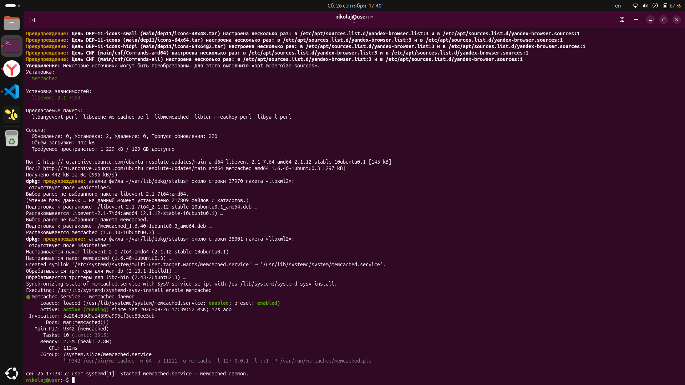
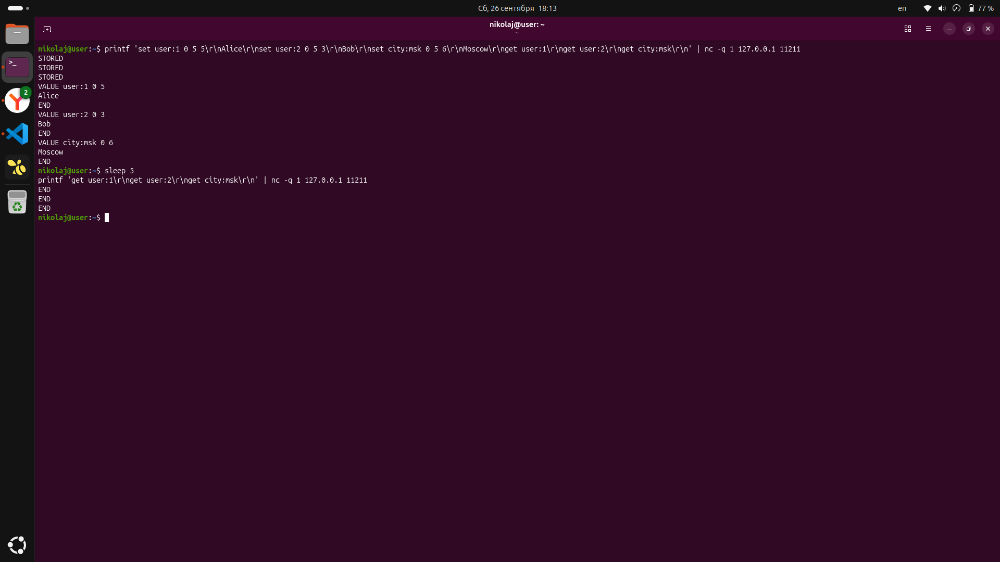
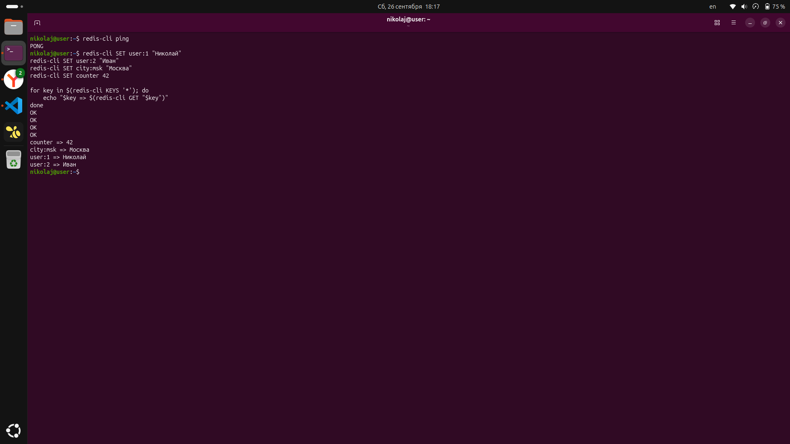

Отчёт по практической работе
Выполнил: Николай Галицин

Задание 1. Кеширование
Приведите примеры проблем, которые может решить кеширование.

Кеширование — это способ хранения часто запрашиваемых данных в быстром промежуточном хранилище (оперативная память, SSD, отдельный сервис), чтобы не обращаться каждый раз к более медленному источнику. На практике оно решает целый ряд задач:

Высокая нагрузка на базу данных. Если один и тот же запрос (например, список популярных товаров) выполняется тысячи раз в секунду, БД быстро упирается в лимит по CPU и диску. Кеш позволяет отдавать результат из памяти, снижая нагрузку на БД в разы.

Медленный отклик API и сайта. Запросы, требующие тяжёлых вычислений или агрегации данных из нескольких источников, можно закешировать. Пользователь получает ответ за миллисекунды вместо секунд.

Повторные дорогие вычисления. Результат рендеринга страницы, отчёт, выборка из аналитики — если данные меняются редко, нет смысла пересчитывать их каждый раз.

Снижение нагрузки на внешние сервисы. Если приложение обращается к стороннему API с лимитами (rate limit), кеш помогает не превышать их и экономить деньги за платные запросы.

Пиковые нагрузки (traffic spikes). При резком наплыве пользователей (распродажа, вирусный пост) кеш сглаживает нагрузку и не даёт бэкенду упасть.

Снижение задержек для географически удалённых пользователей. Кеширование на CDN или в edge-узлах ускоряет доставку контента.

Экономия ресурсов и денег. Меньше запросов к БД и внешним API — меньше нужны мощности серверов и меньше счёт за облако.

Повышение отказоустойчивости. Если основная БД временно недоступна, часть данных можно отдать из кеша, и сервис останется работоспособным.

Задание 2. Memcached
Установите и запустите memcached.

Установка и запуск:

bash
sudo apt update
sudo apt install -y memcached
sudo systemctl enable memcached
sudo systemctl start memcached
sudo systemctl status memcached
Скриншот systemctl status memcached:

Видно, что сервис находится в состоянии active (running) — memcached запущен и работает.

Задание 3. Удаление по TTL в Memcached
Запишите в memcached несколько ключей с любыми именами и значениями, для которых выставлен TTL 5.

Записываю три ключа с TTL = 5 секунд, сразу же проверяю их наличие, затем жду 5 секунд и проверяю повторно:

bash
# Запись ключей с TTL=5 и немедленная проверка
printf 'set user:1 0 5 5\r\nAlice\r\nset user:2 0 5 3\r\nBob\r\nset city:msk 0 5 6\r\nMoscow\r\nget user:1\r\nget user:2\r\nget city:msk\r\n' | nc -q 1 127.0.0.1 11211

# Ожидание 5 секунд и повторная проверка
sleep 5
echo "--- через 5 секунд ---"
printf 'get user:1\r\nget user:2\r\nget city:msk\r\n' | nc -q 1 127.0.0.1 11211
Скриншот с результатом:

На скриншоте видно, что:

сразу после записи команды get возвращают значения Alice, Bob, Moscow — ключи присутствуют в базе;

спустя 5 секунд те же команды get возвращают только END — ключи автоматически удалились по истечении TTL.

Таким образом, механизм удаления по TTL в memcached работает корректно.

Задание 4. Запись данных в Redis
Запишите в Redis несколько ключей с любыми именами и значениями. Через redis-cli достаньте все записанные ключи и значения из базы.

Проверяю, что сервер Redis отвечает:

bash
redis-cli ping
Записываю четыре ключа с произвольными значениями и вывожу все ключи вместе с их значениями:

bash
redis-cli SET user:1 "Николай"
redis-cli SET user:2 "Иван"
redis-cli SET city:msk "Москва"
redis-cli SET counter 42

for key in $(redis-cli KEYS '*'); do
    echo "$key => $(redis-cli GET "$key")"
done
Скриншот операции:

На скриншоте видно:

redis-cli ping вернул PONG — сервер доступен;

все четыре команды SET вернули OK — ключи успешно записаны;

цикл по KEYS * вывел все ключи и их значения:

counter => 42

city:msk => Москва

user:1 => Николай

user:2 => Иван

Все записанные данные успешно извлечены из базы Redis.

